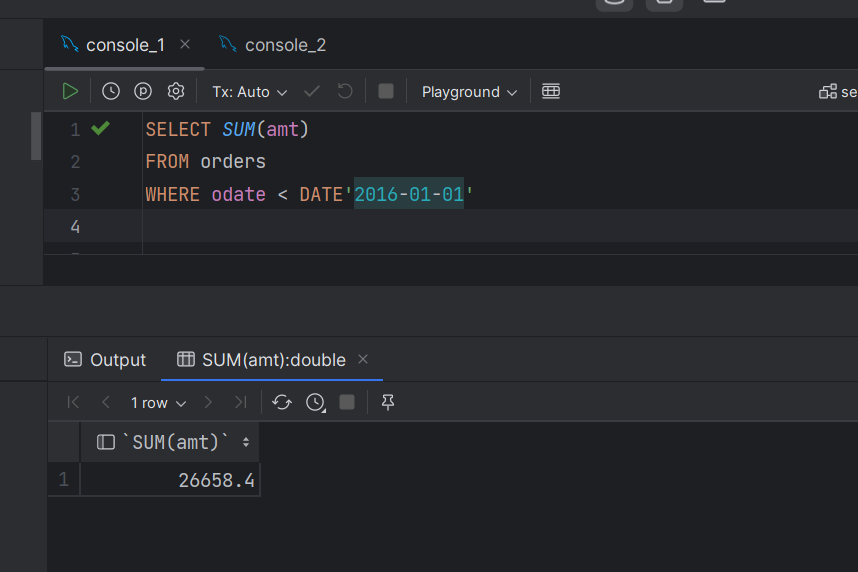

1. Напишите запрос, который сосчитал бы все суммы заказов, выполненных 1 января 2016 года.

2. Напишите запрос, который сосчитал бы число различных, отличных от NULL значений поля city в таблице заказчиков.

3. Напишите запрос, который выбрал бы наименьшую сумму для каждого заказчика.

4. *. Напишите запрос, который бы выбирал заказчиков чьи имена начинаются с буквы Г. Используется оператор "LIKE": https://dev.mysql.com/doc/refman/8.0/en/string-comparison-functions.html
    

5. Напишите запрос, который выбрал бы высший рейтинг в каждом городе.

   Задание №2.

   Отсортируйте поле “сумма” в порядке убывания и возрастания

   Отсортируйте по возрастанию поле “Зарплата” и выведите 5 строк с наибольшей заработной платой

   Выполните группировку всех сотрудников по специальности “рабочий”, зарплата которых превышает 20000

Опять не очень понял причем тут группировка

