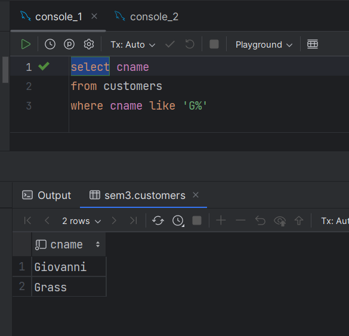
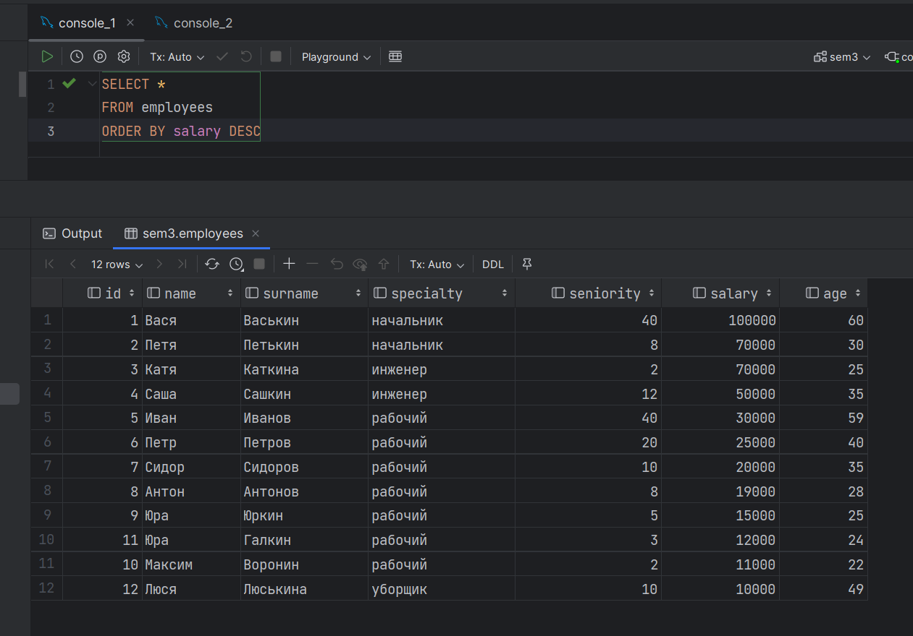
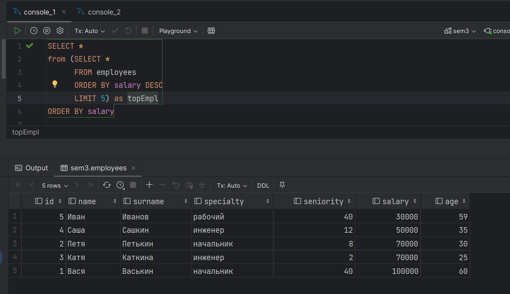

1.  Напишите запрос, который вывел бы таблицу со столбцами в следующем порядке: city, sname, snum, comm. (к первой или второй таблице, используя SELECT)

2.  Напишите команду SELECT, которая вывела бы оценку(rating), сопровождаемую именем каждого заказчика в городе San Jose. (“заказчики”)

3.  Напишите запрос, который вывел бы значения snum всех продавцов из таблицы заказов без каких бы то ни было повторений. (уникальные значения в  “snum“ “Продавцы”)

4. *. Напишите запрос, который бы выбирал заказчиков, чьи имена начинаются с буквы G. Используется оператор "LIKE": (“заказчики”) https://dev.mysql.com/doc/refman/8.0/en/string-comparison-functions.html

5. Напишите запрос, который может дать вам все заказы со значениями суммы выше чем $1,000. (“Заказы”, “amt”  - сумма)

6. Напишите запрос который выбрал бы наименьшую сумму заказа.
   (Из поля “amt” - сумма в таблице “Заказы” выбрать наименьшее значение)

7. Напишите запрос к таблице “Заказчики”, который может показать всех заказчиков, у которых рейтинг больше 100 и они находятся не в Риме.

###################################################################

1.  Отсортируйте поле “зарплата” в порядке убывания и возрастания

2. ** Отсортируйте по возрастанию поле “Зарплата” и выведите 5 строк с наибольшей заработной платой (возможен подзапрос)

3. Выполните группировку всех сотрудников по специальности , суммарная зарплата которых превышает 100000

Я не понял это задание - ни у одного рабочего нет такой ЗП. Попробовал собрать суммы всех специальностей. Уборщик сюда не попал

